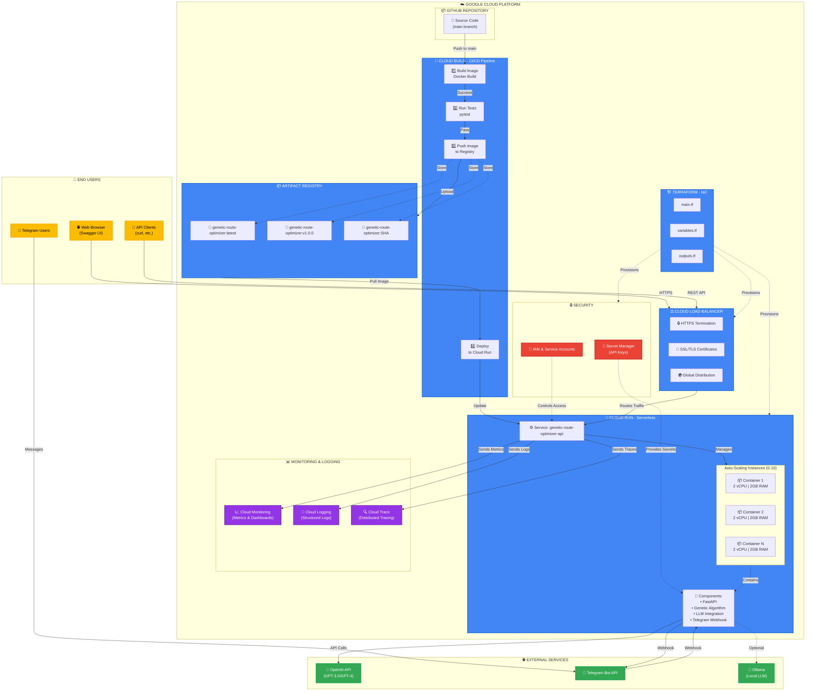

# 🏗️ Arquitetura da Solução em Google Cloud Platform

## 📋 Índice

1. [Visão Geral](#-visão-geral)
2. [Arquitetura de Alto Nível](#️-arquitetura-de-alto-nível)
3. [Componentes da Infraestrutura](#-componentes-da-infraestrutura)
4. [Fluxo de Deploy (CI/CD)](#-fluxo-de-deploy-cicd)
5. [Segurança e Boas Práticas](#-segurança-e-boas-práticas)
6. [Escalabilidade e Performance](#-escalabilidade-e-performance)
7. [Monitoramento e Observabilidade](#-monitoramento-e-observabilidade)
8. [Custos e Otimização](#-custos-e-otimização)
9. [Disaster Recovery](#-disaster-recovery)
10. [Conclusão](#-conclusão)

---

## 🎯 Visão Geral

### Objetivo da Solução

Sistema de otimização de rotas para múltiplos veículos utilizando Algoritmo Genético, deployado em Google Cloud Platform com arquitetura serverless, escalável e de alta disponibilidade.

### Características Principais

- ✅ **Serverless**: Cloud Run para execução de containers sem gerenciamento de servidores
- ✅ **CI/CD Automatizado**: Google Cloud Build para integração e deploy contínuos
- ✅ **Infraestrutura como Código**: Terraform para provisionamento reproduzível
- ✅ **Containerização**: Docker para portabilidade e consistência
- ✅ **Alta Disponibilidade**: Escalabilidade automática e distribuição geográfica
- ✅ **Segurança**: IAM, HTTPS, variáveis de ambiente seguras

---

## 🏛️ Arquitetura de Alto Nível

### Diagrama em Mermaid

> **💡 Como visualizar interativamente:**
> - Visualize este arquivo no **GitHub** ou **GitLab** para ver o diagrama renderizado e interativo
> - Use a extensão **Markdown Preview Mermaid Support** no VS Code
> - Acesse [Mermaid Live Editor](https://mermaid.live/) e cole o código do diagrama
> - O diagrama abaixo pode aparecer pequeno no VS Code - use as opções acima para melhor visualização



### Diagrama ASCII (Texto)

```
┌─────────────────────────────────────────────────────────────────────────────┐
│                           👥 END USERS                                      │
├─────────────────────────────────────────────────────────────────────────────┤
│  ┌──────────────────┐  ┌──────────────────┐  ┌──────────────────┐           │
│  │  🌐 Web Browser  │  │  💬 Telegram     │  │  🔧 API Clients  │           │
│  │  (Swagger UI)    │  │  Users           │  │  (curl, etc.)    │           │
│  └──────────────────┘  └──────────────────┘  └──────────────────┘           │
└─────────────────────────────────────────────────────────────────────────────┘
                 │                    │                    │
                 └────────────────────┼────────────────────┘
                                      ↓ HTTPS
┌─────────────────────────────────────────────────────────────────────────────┐
│                        ☁️ GOOGLE CLOUD PLATFORM                             │
├─────────────────────────────────────────────────────────────────────────────┤
│                                                                             │
│  ┌───────────────────────────────────────────────────────────────────────┐  │
│  │                      📦 GITHUB REPOSITORY                             │  │
│  │  ┌─────────────────────────────────────────────────────────────────┐  │  │
│  │  │  📝 Source Code (main branch)                                   │  │  │
│  │  └─────────────────────────────────────────────────────────────────┘  │  │
│  └───────────────────────────────────────────────────────────────────────┘  │
│                                      ↓ Push to main                         │
│  ┌───────────────────────────────────────────────────────────────────────┐  │
│  │                   🔨 CLOUD BUILD - CI/CD Pipeline                     │  │
│  │  ┌──────────────┐  ┌──────────────┐  ┌──────────────┐  ┌-──────────┐  │  │
│  │  │ 1️⃣ Build     │→ │ 2️⃣ Run Tests │→ │ 3️⃣ Push      │→ │ 4️⃣ Deploy │  │  │
│  │  │ Image        │  │ (pytest)     │  │ Image        │  │ to Run    │  │  │
│  │  │ Docker Build │  │              │  │ to Registry  │  │           │  │  │
│  │  └──────────────┘  └──────────────┘  └──────────────┘  └─────────-─┘  │  │
│  └───────────────────────────────────────────────────────────────────────┘  │
│                                      ↓                                      │
│  ┌───────────────────────────────────────────────────────────────────────┐  │
│  │                      📦 ARTIFACT REGISTRY                             │  │
│  │  ┌─────────────────────────────────────────────────────────────────┐  │  │
│  │  │  🐳 genetic-route-optimizer:latest                              │  │  │
│  │  │  🐳 genetic-route-optimizer:v1.0.0                              │  │  │
│  │  │  🐳 genetic-route-optimizer:SHA                                 │  │  │
│  │  └─────────────────────────────────────────────────────────────────┘  │  │
│  └───────────────────────────────────────────────────────────────────────┘  │
│                                      ↓ Pull Image                           │
│  ┌───────────────────────────────────────────────────────────────────────┐  │
│  │                    🚀 CLOUD RUN - Serverless                          │  │
│  │  ┌─────────────────────────────────────────────────────────────────┐  │  │
│  │  │  ⚙️ Service: genetic-route-optimizer-api                        │  │  │
│  │  │                                                                 │  │  │
│  │  │  ┌─────────────────────────────────────────────────────────┐    │  │  │
│  │  │  │  Auto-Scaling Instances (0-10)                          │    │  │  │
│  │  │  │  ┌──────────────┐  ┌──────────────┐  ┌──────────────┐   │    │  │  │
│  │  │  │  │ 📦 Container │  │ 📦 Container │  │ 📦 Container │   │    │  │  │
│  │  │  │  │ 1            │  │ 2            │  │ N            │   │    │  │  │
│  │  │  │  │ 2vCPU|2GB    │  │ 2vCPU|2GB    │  │ 2vCPU|2GB    │   │    │  │  │
│  │  │  │  └──────────────┘  └──────────────┘  └──────────────┘   │    │  │  │
│  │  │  └─────────────────────────────────────────────────────────┘    │  │  │
│  │  │                                                                 │  │  │
│  │  │  🔧 Components:                                                 │  │  │
│  │  │  • FastAPI                                                      │  │  │
│  │  │  • Genetic Algorithm                                            │  │  │
│  │  │  • LLM Integration                                              │  │  │
│  │  │  • Telegram Webhook                                             │  │  │
│  │  └─────────────────────────────────────────────────────────────────┘  │  │
│  └───────────────────────────────────────────────────────────────────────┘  │
│                                      ↓                                      │
│  ┌───────────────────────────────────────────────────────────────────────┐  │
│  │                    ⚖️ CLOUD LOAD BALANCER                             │  │
│  │  ┌─────────────────────────────────────────────────────────────────┐  │  │
│  │  │  🔒 HTTPS Termination                                           │  │  │
│  │  │  🔐 SSL/TLS Certificates                                        │  │  │
│  │  │  🌍 Global Distribution                                         │  │  │
│  │  └─────────────────────────────────────────────────────────────────┘  │  │
│  └───────────────────────────────────────────────────────────────────────┘  │
│                                                                             │
│  ┌───────────────────────────────────────────────────────────────────────┐  │
│  │                    🏗️ TERRAFORM - IaC                                 │  │
│  │  ┌──────────────┐  ┌──────────────┐  ┌──────────────┐                 │  │
│  │  │    main.tf   │  │ variables.tf │  │  outputs.tf  │                 │  │
│  │  └──────────────┘  └──────────────┘  └──────────────┘                 │  │
│  │         └──────────────────┼──────────────────┘                       │  │
│  │                            ↓ Provisions                               │  │
│  │              (Cloud Run, Load Balancer, Security)                     │  │
│  └───────────────────────────────────────────────────────────────────────┘  │
│                                                                             │
│  ┌───────────────────────────────────────────────────────────────────────┐  │
│  │                    📊 MONITORING & LOGGING                            │  │
│  │  ┌──────────────────┐  ┌──────────────────┐  ┌──────────────────┐     │  │
│  │  │ 📈 Cloud         │  │ 📝 Cloud         │  │ 🔍 Cloud         │     │  │
│  │  │ Monitoring       │  │ Logging          │  │ Trace            │     │  │
│  │  │ (Metrics)        │  │ (Logs)           │  │ (Tracing)        │     │  │
│  │  └──────────────────┘  └──────────────────┘  └──────────────────┘     │  │
│  │                            ↑ Sends Metrics/Logs/Traces                │  │
│  └───────────────────────────────────────────────────────────────────────┘  │
│                                                                             │
│  ┌───────────────────────────────────────────────────────────────────────┐  │
│  │                         🔒 SECURITY                                   │  │
│  │  ┌──────────────────────────┐  ┌──────────────────────────┐           │  │
│  │  │ 🔑 Secret Manager        │  │ 👤 IAM &                 │           │  │
│  │  │ (API Keys)               │  │ Service Accounts         │           │  │
│  │  └──────────────────────────┘  └──────────────────────────┘           │  │
│  │              ↓ Provides Secrets         ↓ Controls Access             │  │
│  └───────────────────────────────────────────────────────────────────────┘  │
│                                                                             │
└─────────────────────────────────────────────────────────────────────────────┘
                 │                    │                    │
                 └────────────────────┼────────────────────┘
                                      ↓ API Calls / Webhooks
┌─────────────────────────────────────────────────────────────────────────────┐
│                         🌐 EXTERNAL SERVICES                                │
├─────────────────────────────────────────────────────────────────────────────┤
│  ┌──────────────────┐  ┌──────────────────┐  ┌──────────────────┐           │
│  │  🤖 OpenAI API   │  │  💬 Telegram     │  │  🦙 Ollama       │           │
│  │  (GPT-3.5/GPT-4) │  │  Bot API         │  │  (Local LLM)     │           │
│  └──────────────────┘  └──────────────────┘  └──────────────────┘           │
└─────────────────────────────────────────────────────────────────────────────┘
```

---

## 🔧 Componentes da Infraestrutura

### 1. **Google Cloud Run**

#### Características
- **Tipo**: Plataforma serverless para containers
- **Modelo de Cobrança**: Pay-per-use (por requisição e tempo de CPU)
- **Escalabilidade**: Automática (0 a N instâncias)
- **Região**: us-central1 (configurável)

#### Configuração Atual

```hcl
# terraform/main.tf
resource "google_cloud_run_service" "genetic_route_optimizer" {
  name     = "genetic-route-optimizer-api"
  location = var.region

  template {
    spec {
      containers {
        image = "gcr.io/${var.project_id}/genetic-route-optimizer:latest"
        
        ports {
          container_port = 8080
        }

        resources {
          limits = {
            cpu    = "2000m"    # 2 vCPUs
            memory = "2Gi"      # 2 GB RAM
          }
        }

        env {
          name  = "OPENAI_API_KEY"
          value = var.openai_api_key
        }
        
        env {
          name  = "TELEGRAM_BOT_TOKEN"
          value = var.telegram_bot_token
        }
      }

      container_concurrency = 80
      timeout_seconds       = 300  # 5 minutos
    }

    metadata {
      annotations = {
        "autoscaling.knative.dev/minScale" = "0"
        "autoscaling.knative.dev/maxScale" = "10"
      }
    }
  }

  traffic {
    percent         = 100
    latest_revision = true
  }
}
```

#### Justificativa Técnica

1. **Serverless**: Elimina necessidade de gerenciar servidores
2. **Custo-Efetivo**: Paga apenas quando há requisições
3. **Escalabilidade**: Ajusta automaticamente à demanda
4. **HTTPS Nativo**: Certificados SSL/TLS gerenciados automaticamente
5. **Integração**: Nativa com outros serviços GCP

---

### 2. **Google Artifact Registry**

#### Características
- **Tipo**: Registro de containers gerenciado
- **Formato**: Docker images
- **Versionamento**: Tags (latest, v1.0.0, etc.)
- **Segurança**: Controle de acesso via IAM

#### Estrutura de Imagens

```
gcr.io/[PROJECT_ID]/genetic-route-optimizer:latest
gcr.io/[PROJECT_ID]/genetic-route-optimizer:v1.0.0
gcr.io/[PROJECT_ID]/genetic-route-optimizer:v1.0.1
```

#### Configuração

```yaml
# cloudbuild.yaml
images:
  - 'gcr.io/$PROJECT_ID/genetic-route-optimizer:latest'
  - 'gcr.io/$PROJECT_ID/genetic-route-optimizer:$SHORT_SHA'
  - 'gcr.io/$PROJECT_ID/genetic-route-optimizer:v1.0.0'
```

#### Vantagens

1. **Versionamento**: Múltiplas versões da aplicação
2. **Rollback**: Fácil retorno a versões anteriores
3. **Segurança**: Scan automático de vulnerabilidades
4. **Performance**: Cache de layers para builds rápidos

---

### 3. **Google Cloud Build**

#### Pipeline CI/CD

```yaml
# cloudbuild.yaml
steps:
  # Step 1: Build Docker Image
  - name: 'gcr.io/cloud-builders/docker'
    args:
      - 'build'
      - '-t'
      - 'gcr.io/$PROJECT_ID/genetic-route-optimizer:latest'
      - '-t'
      - 'gcr.io/$PROJECT_ID/genetic-route-optimizer:$SHORT_SHA'
      - '-t'
      - 'gcr.io/$PROJECT_ID/genetic-route-optimizer:v1.0.0'
      - '.'
    timeout: '600s'

  # Step 2: Push to Artifact Registry
  - name: 'gcr.io/cloud-builders/docker'
    args:
      - 'push'
      - 'gcr.io/$PROJECT_ID/genetic-route-optimizer:latest'

  # Step 3: Deploy to Cloud Run
  - name: 'gcr.io/cloud-builders/gcloud'
    args:
      - 'run'
      - 'deploy'
      - 'genetic-route-optimizer-api'
      - '--image'
      - 'gcr.io/$PROJECT_ID/genetic-route-optimizer:latest'
      - '--region'
      - 'us-central1'
      - '--platform'
      - 'managed'
      - '--allow-unauthenticated'
      - '--port'
      - '8080'
      - '--memory'
      - '2Gi'
      - '--cpu'
      - '2'
      - '--timeout'
      - '300'
      - '--max-instances'
      - '10'
      - '--min-instances'
      - '0'

timeout: '1200s'  # 20 minutos
```

#### Fluxo de Execução

1. **Trigger**: Push para branch `main` no GitHub
2. **Build**: Construção da imagem Docker
3. **Test**: Execução de testes automatizados (opcional)
4. **Push**: Upload da imagem para Artifact Registry
5. **Deploy**: Atualização do serviço no Cloud Run
6. **Verificação**: Health check automático

#### Tempo de Deploy

- **Build**: ~3-5 minutos
- **Push**: ~1-2 minutos
- **Deploy**: ~1-2 minutos
- **Total**: ~5-10 minutos

---

### 4. **Terraform (Infraestrutura como Código)**

#### Estrutura de Arquivos

```
terraform/
├── main.tf           # Recursos principais
├── variables.tf      # Variáveis de entrada
├── outputs.tf        # Outputs do Terraform
├── provider.tf       # Configuração do provider GCP
└── terraform.tfvars  # Valores das variáveis
```

#### Recursos Provisionados

```hcl
# terraform/main.tf

# 1. Cloud Run Service
resource "google_cloud_run_service" "genetic_route_optimizer" {
  # ... configuração detalhada acima
}

# 2. IAM Policy - Acesso Público
resource "google_cloud_run_service_iam_member" "public_access" {
  service  = google_cloud_run_service.genetic_route_optimizer.name
  location = google_cloud_run_service.genetic_route_optimizer.location
  role     = "roles/run.invoker"
  member   = "allUsers"
}

# 3. Service Account (opcional)
resource "google_service_account" "cloud_run_sa" {
  account_id   = "genetic-route-optimizer-sa"
  display_name = "Cloud Run Service Account"
}
```

#### Comandos Terraform

```bash
# Inicializar Terraform
terraform init

# Planejar mudanças
terraform plan

# Aplicar infraestrutura
terraform apply

# Destruir infraestrutura
terraform destroy
```

#### Vantagens do IaC

1. **Reprodutibilidade**: Mesma infraestrutura em qualquer ambiente
2. **Versionamento**: Histórico de mudanças no Git
3. **Documentação**: Código é a documentação
4. **Automação**: Deploy automatizado
5. **Rollback**: Fácil retorno a estados anteriores

---

## 🔄 Fluxo de Deploy (CI/CD)

### Pipeline Completo

```
┌─────────────────────────────────────────────────────────────────┐
│                    DESENVOLVIMENTO LOCAL                        │
├─────────────────────────────────────────────────────────────────┤
│  1. Desenvolvedor faz commit no código                          │
│  2. Push para branch main no GitHub                             │
└─────────────────────────────────────────────────────────────────┘
                            ↓
┌─────────────────────────────────────────────────────────────────┐
│                    GOOGLE CLOUD BUILD                           │
├─────────────────────────────────────────────────────────────────┤
│  3. Trigger automático detecta push                             │
│  4. Clone do repositório                                        │
│  5. Build da imagem Docker                                      │
│     └─ Dockerfile → Container Image                             │
│  6. (Opcional) Execução de testes                               │
│     └─ pytest tests/ -v                                         │
│  7. Push da imagem para Artifact Registry                       │
│     └─ gcr.io/PROJECT_ID/genetic-route-optimizer:latest         │
└─────────────────────────────────────────────────────────────────┘
                            ↓
┌─────────────────────────────────────────────────────────────────┐
│                    ARTIFACT REGISTRY                            │
├─────────────────────────────────────────────────────────────────┤
│  8. Armazenamento da imagem                                     │
│  9. Versionamento (latest, SHA, v1.0.0)                         │
│  10. Scan de vulnerabilidades                                   │
└─────────────────────────────────────────────────────────────────┘
                            ↓
┌─────────────────────────────────────────────────────────────────┐
│                    GOOGLE CLOUD RUN                             │
├─────────────────────────────────────────────────────────────────┤
│  11. Deploy da nova revisão                                     │
│  12. Health check da aplicação                                  │
│  13. Migração gradual de tráfego (Blue/Green)                   │
│  14. Rollback automático se falhar                              │
└─────────────────────────────────────────────────────────────────┘
                            ↓
┌─────────────────────────────────────────────────────────────────┐
│                    PRODUÇÃO                                     │
├─────────────────────────────────────────────────────────────────┤
│  15. Aplicação disponível em:                                   │
│      https://genetic-route-optimizer-api-[HASH].a.run.app       │
│  16. Swagger UI acessível em /docs                              │
│  17. Webhook do Telegram configurado                            │
└─────────────────────────────────────────────────────────────────┘
```

### Estratégia de Deploy

#### Blue/Green Deployment

```hcl
traffic {
  percent         = 100
  latest_revision = true
}
```

- **Blue**: Versão atual em produção
- **Green**: Nova versão sendo deployada
- **Migração**: Gradual (0% → 100%)
- **Rollback**: Instantâneo se necessário

---

## 🔒 Segurança e Boas Práticas

### 1. **Gerenciamento de Secrets**

#### Variáveis de Ambiente Seguras

```hcl
# terraform/main.tf
env {
  name = "OPENAI_API_KEY"
  value_from {
    secret_key_ref {
      name = "openai-api-key"
      key  = "latest"
    }
  }
}
```

#### Google Secret Manager (Recomendado)

```bash
# Criar secret
gcloud secrets create openai-api-key \
  --data-file=- <<< "sk-proj-..."

# Dar acesso ao Cloud Run
gcloud secrets add-iam-policy-binding openai-api-key \
  --member="serviceAccount:PROJECT_NUMBER-compute@developer.gserviceaccount.com" \
  --role="roles/secretmanager.secretAccessor"
```

### 2. **IAM e Controle de Acesso**

#### Princípio do Menor Privilégio

```hcl
# Service Account com permissões mínimas
resource "google_service_account" "cloud_run_sa" {
  account_id   = "genetic-route-optimizer-sa"
  display_name = "Cloud Run Service Account"
}

# Permissões específicas
resource "google_project_iam_member" "cloud_run_permissions" {
  project = var.project_id
  role    = "roles/run.invoker"
  member  = "serviceAccount:${google_service_account.cloud_run_sa.email}"
}
```

### 3. **HTTPS e Certificados**

- ✅ **HTTPS Obrigatório**: Cloud Run força HTTPS
- ✅ **Certificados Gerenciados**: Renovação automática
- ✅ **TLS 1.2+**: Protocolos seguros apenas

### 4. **Proteção contra DDoS (Distributed Denial of Service)**

```hcl
metadata {
  annotations = {
    "run.googleapis.com/cpu-throttling" = "true"
    "autoscaling.knative.dev/maxScale"  = "10"
  }
}
```

### 5. **Auditoria e Logs**

```bash
# Visualizar logs
gcloud logging read "resource.type=cloud_run_revision" \
  --limit 50 \
  --format json

# Métricas de acesso
gcloud monitoring time-series list \
  --filter='metric.type="run.googleapis.com/request_count"'
```

---

## 📈 Escalabilidade e Performance

### Configuração de Auto-Scaling

```hcl
metadata {
  annotations = {
    # Mínimo de instâncias (0 = scale to zero)
    "autoscaling.knative.dev/minScale" = "0"
    
    # Máximo de instâncias
    "autoscaling.knative.dev/maxScale" = "10"
    
    # Requisições por instância
    "autoscaling.knative.dev/target" = "80"
  }
}
```

### Métricas de Escalabilidade

| Métrica | Valor | Justificativa |
|---------|-------|---------------|
| **Min Instances** | 0 | Reduz custos quando não há tráfego |
| **Max Instances** | 10 | Limita custos e previne sobrecarga |
| **Concurrency** | 80 | Requisições simultâneas por instância |
| **CPU** | 2 vCPUs | Suficiente para algoritmo genético |
| **Memory** | 2 GB | Adequado para processamento de rotas |
| **Timeout** | 300s | Permite otimizações complexas |

### Cold Start Optimization

```dockerfile
# Dockerfile otimizado
FROM python:3.11-slim

# Cache de dependências
COPY requirements.txt .
RUN pip install --no-cache-dir -r requirements.txt

# Código da aplicação
COPY . .

# Pré-compilação de bytecode
RUN python -m compileall .

CMD ["uvicorn", "api.main:app", "--host", "0.0.0.0", "--port", "8080"]
```

**Tempo de Cold Start**: ~2-3 segundos

---

## 📊 Monitoramento e Observabilidade

### 1. **Cloud Monitoring**

#### Métricas Principais

```yaml
Métricas Disponíveis:
  - Request Count: Número de requisições
  - Request Latency: Tempo de resposta
  - Container CPU Utilization: Uso de CPU
  - Container Memory Utilization: Uso de memória
  - Container Instance Count: Número de instâncias
  - Billable Instance Time: Tempo faturável
```

#### Dashboard Personalizado

```bash
# Criar dashboard
gcloud monitoring dashboards create --config-from-file=dashboard.json
```

### 2. **Cloud Logging**

#### Logs Estruturados

```python
# api/main.py
import logging
import json

logger = logging.getLogger(__name__)

@app.post("/optimize")
async def optimize_route(request: OptimizationRequest):
    logger.info(json.dumps({
        "event": "optimization_started",
        "num_points": len(request.service_points),
        "num_vehicles": request.num_vehicles
    }))
    
    # ... processamento
    
    logger.info(json.dumps({
        "event": "optimization_completed",
        "execution_time": elapsed_time,
        "best_fitness": best_fitness
    }))
```

### 3. **Cloud Trace**

- **Distributed Tracing**: Rastreamento de requisições
- **Latency Analysis**: Análise de gargalos
- **Performance Insights**: Identificação de otimizações

### 4. **Alertas**

```yaml
# Alerta de alta latência
alert_policy:
  display_name: "High Latency Alert"
  conditions:
    - display_name: "Request latency > 5s"
      condition_threshold:
        filter: 'metric.type="run.googleapis.com/request_latencies"'
        comparison: COMPARISON_GT
        threshold_value: 5000
        duration: 60s
  notification_channels:
    - email: admin@example.com
```

---

## 💰 Custos e Otimização

### Modelo de Cobrança Cloud Run

```
Custo = (CPU Time × CPU Price) + (Memory Time × Memory Price) + (Requests × Request Price)
```

#### Preços (us-central1)

| Recurso | Preço | Unidade |
|---------|-------|---------|
| **CPU** | $0.00002400 | vCPU-second |
| **Memory** | $0.00000250 | GB-second |
| **Requests** | $0.40 | 1 milhão |

### Estimativa de Custos Mensais

#### Cenário 1: Baixo Tráfego (100 req/dia)

```
Requisições/mês: 3.000
Tempo médio: 2s
CPU: 2 vCPUs
Memory: 2 GB

Custo CPU: 3.000 × 2s × 2 vCPUs × $0.000024 = $0.29
Custo Memory: 3.000 × 2s × 2 GB × $0.0000025 = $0.03
Custo Requests: 3.000 × $0.40/1M = $0.001

Total: ~$0.32/mês
```

#### Cenário 2: Médio Tráfego (1.000 req/dia)

```
Requisições/mês: 30.000
Tempo médio: 2s

Total: ~$3.20/mês
```

#### Cenário 3: Alto Tráfego (10.000 req/dia)

```
Requisições/mês: 300.000
Tempo médio: 2s

Total: ~$32.00/mês
```

### Otimizações de Custo

1. **Scale to Zero**: Instâncias = 0 quando sem tráfego
2. **CPU Throttling**: Reduz CPU quando idle
3. **Memory Optimization**: Apenas 2 GB necessários
4. **Request Batching**: Agrupa requisições quando possível
5. **Caching**: Reduz processamento repetido

---

## 🔄 Disaster Recovery

### Estratégia de Backup

#### 1. **Código Fonte**
- ✅ **GitHub**: Repositório principal
- ✅ **Versionamento**: Git tags e branches
- ✅ **Backup**: GitHub Actions para backup automático

#### 2. **Imagens Docker**
- ✅ **Artifact Registry**: Múltiplas versões
- ✅ **Retenção**: 30 dias (configurável)
- ✅ **Replicação**: Multi-região (opcional)

#### 3. **Configuração**
- ✅ **Terraform State**: Backend remoto (GCS)
- ✅ **Variáveis**: Secret Manager
- ✅ **Documentação**: Markdown no repositório

### RTO e RPO

| Métrica | Valor | Descrição |
|---------|-------|-----------|
| **RTO** | < 10 min | Recovery Time Objective |
| **RPO** | < 1 min | Recovery Point Objective |

### Procedimento de Rollback

```bash
# 1. Listar revisões
gcloud run revisions list \
  --service=genetic-route-optimizer-api \
  --region=us-central1

# 2. Rollback para revisão anterior
gcloud run services update-traffic genetic-route-optimizer-api \
  --to-revisions=REVISION_NAME=100 \
  --region=us-central1

# 3. Verificar status
gcloud run services describe genetic-route-optimizer-api \
  --region=us-central1
```

**Tempo de Rollback**: < 2 minutos

---

## 📝 Checklist de Deploy

### Pré-Deploy

- [ ] Código testado localmente
- [ ] Testes automatizados passando
- [ ] Variáveis de ambiente configuradas
- [ ] Secrets criados no Secret Manager
- [ ] Terraform plan executado
- [ ] Documentação atualizada

### Deploy

- [ ] Push para branch main
- [ ] Cloud Build iniciado
- [ ] Build concluído com sucesso
- [ ] Imagem no Artifact Registry
- [ ] Deploy no Cloud Run concluído
- [ ] Health check passou

### Pós-Deploy

- [ ] Swagger UI acessível
- [ ] Endpoints funcionando
- [ ] Logs sem erros
- [ ] Métricas normais
- [ ] Webhook do Telegram configurado
- [ ] Testes de integração executados

---

## 🎓 Conclusão

### Benefícios da Arquitetura

1. **Escalabilidade**: Auto-scaling de 0 a 10 instâncias
2. **Custo-Efetivo**: Pay-per-use, sem custos fixos
3. **Alta Disponibilidade**: SLA de 99.95%
4. **Segurança**: HTTPS, IAM, Secret Manager
5. **Manutenibilidade**: IaC com Terraform
6. **CI/CD**: Deploy automatizado
7. **Observabilidade**: Logs, métricas e traces
8. **Disaster Recovery**: Rollback em < 2 minutos

### Diferenciais Técnicos

- ✅ **Serverless**: Sem gerenciamento de infraestrutura
- ✅ **Containerização**: Portabilidade total
- ✅ **IaC**: Infraestrutura versionada e reproduzível
- ✅ **Multi-Região**: Possibilidade de expansão global
- ✅ **Green IT**: Recursos alocados apenas quando necessário

### Próximos Passos

1. **Multi-Região**: Deploy em múltiplas regiões
2. **CDN**: Cloud CDN para assets estáticos
3. **Database**: Cloud SQL para persistência
4. **Cache**: Memorystore (Redis) para cache
5. **Monitoring**: Alertas avançados e SLOs

---

## 📚 Referências

- [Google Cloud Run Documentation](https://cloud.google.com/run/docs)
- [Terraform GCP Provider](https://registry.terraform.io/providers/hashicorp/google/latest/docs)
- [Cloud Build Documentation](https://cloud.google.com/build/docs)
- [Artifact Registry Documentation](https://cloud.google.com/artifact-registry/docs)
- [Best Practices for Cloud Run](https://cloud.google.com/run/docs/best-practices)

---

**Documento elaborado para avaliação acadêmica - Pós-Tech FIAP**

**Autores**: Fernanda Valdevino, Marcos Câmara

**Data**: Março 2026

**Versão**: 1.0.0
